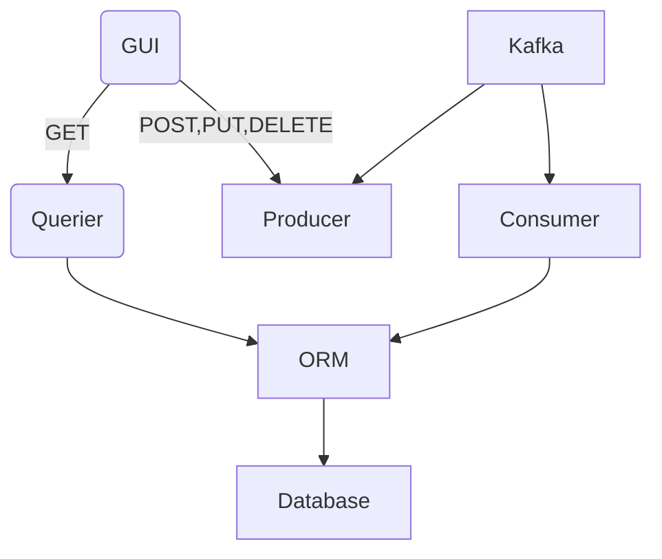

# microservices-example-kube

## About the project:  

This project is a kubernetes translation derived from this [project](https://github.com/davidswisa/microservices-example).

This simple reservation application uses a queue manager for all reservation tasks like create, update, and delete.
And use a more direct approach to get the data from the DB.

### How it all works



### Service Table
| Container | Port | Purpose  |
| :---      | :-   | :- |
| ui        | 8084 | gui |
| cons      | --   | get messages (tasks) from kafka and forwards to orm |
| orm       | 5431 | used as a mitigator for DB |
| prod      | 8080 | receive http request from ui and create messages (tasks) via kafka |
| querier   | 8081 | receive http request from ui and forwards a query via orm |
| kafka     | 9092, 8082, 8083 | message bus |
| zookeeper | 2181 | ? |
| db        | 5432 | data base |


## Prerequisite:

### K3S:

In order to simplify the containers build process we decided to use `kubernetes`.  
The `k3s` is a lite wait kubernetes with docker as the container runtime.  


To install `k3s`:  
``` bash
curl -sfL https://get.k3s.io | sh -s - --docker
```

Configure local kubctl to work with container k3s  

``` bash  
echo "export KUBECONFIG=/etc/rancher/k3s/k3s.yaml" >> ~/.bashrc
```

Load the config
``` bash  
exec bash
```

## Getting Started:

Get the source code:
```bash
git clone https://github.com/davidswisa/microservices-example-kube.git
```

To run the services:  

```bash
make run
```

Now you can open the UI using this link:  

```html
http://<MACHINE-IP>:8084
```

## How can be extended:  

* can add upgared flow for a new pod version
* can be a base for helm charts project  


## For further reading:  

* [converting docker-compose to kubernetes](https://kompose.io/)  

